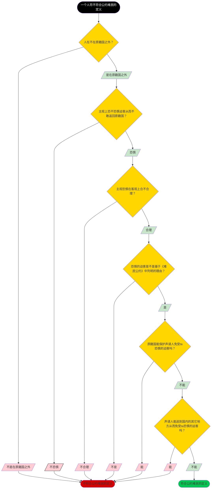

# 流程图：一个人符不符合公约难民的定义？

```mermaid

flowchart TB
    A(["一个人符不符合公约难民的定义"]) --> B{"人在不在原籍国之外？"}
    B --> n2["不是在原籍国之外"] & n3["是在原籍国之外"]
    n2 --> C(["不符合公约难民的定义"])
    n3 --> D["主观上恐不恐惧迫害从而不敢返回原籍国？"]
    D --> n4["不恐惧"] & n5["恐惧"]
    n5 --> n1["主观恐惧在客观上合不合理？"]
    n4 --> C
    n1 --> n6["合理"] & n7["不合理"]
    n7 --> C
    n6 --> n9["恐惧的迫害是不是基于《难民公约》中列明的理由？"]
    n9 --> n10["是"] & n11["不是"]
    n11 --> C
    n10 --> n12["原籍国能保护声请人免受ta恐惧的迫害吗？"]
    n12 --> n13["能"] & n14["不能"]
    n13 --> C
    n14 --> n15["声请人能逃到国内的其它地方从而免受ta恐惧的迫害吗？"]
    n15 --> n16["能"] & n17["不能"]
    n16 --> C
    n17 --> n18(["符合公约难民的定义"])

    n2@{ shape: lean-r}
    n3@{ shape: lean-r}
    D@{ shape: diam}
    n4@{ shape: lean-r}
    n5@{ shape: lean-r}
    n1@{ shape: diam}
    n6@{ shape: lean-r}
    n7@{ shape: lean-r}
    n9@{ shape: diam}
    n10@{ shape: lean-r}
    n11@{ shape: lean-r}
    n12@{ shape: diam}
    n13@{ shape: lean-r}
    n14@{ shape: lean-r}
    n15@{ shape: diam}
    n16@{ shape: lean-r}
    n17@{ shape: lean-r}
    style A fill:#000000,color:#FFFFFF
    style B fill:#FFD600
    style n2 fill:#FFCDD2
    style n3 fill:#C8E6C9
    style C fill:#D50000
    style D fill:#FFD600
    style n4 stroke:#000000,fill:#FFCDD2
    style n5 fill:#C8E6C9
    style n1 fill:#FFD600
    style n6 fill:#C8E6C9
    style n7 fill:#FFCDD2
    style n9 fill:#FFD600
    style n10 fill:#C8E6C9
    style n11 fill:#FFCDD2
    style n12 fill:#FFD600
    style n13 fill:#FFCDD2
    style n14 fill:#C8E6C9
    style n15 fill:#FFD600
    style n16 fill:#FFCDD2
    style n17 fill:#C8E6C9
    style n18 fill:#00C853

```
