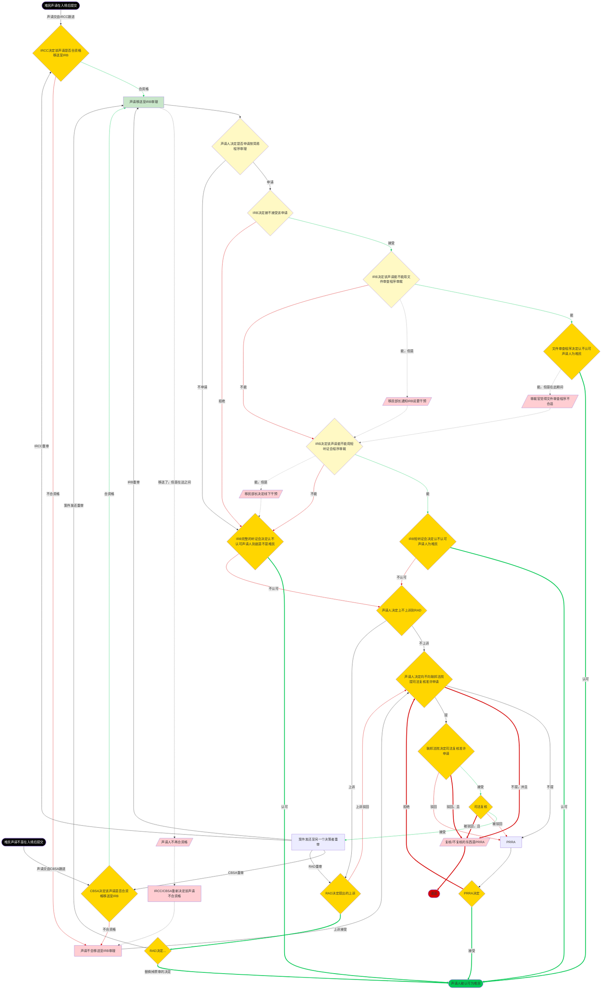

# 加拿大难民审裁流程

```mermaid

flowchart TB
    A(["难民声请在入境后提交"]) -- 声请交由IRCC跟进 --> B["IRCC决定该声请是否合资格移送至IRB"]
    n1(["难民声请不是在入境后提交"]) -- 声请交由CBSA跟进 --> n2["CBSA决定该声请是否合资格移送至IRB"]
    B -- 合资格 --> n3["声请移送至IRB审理"]
    B -- 不合资格 --> n4["声请不会移送至IRB审理"]
    n2 -- 合资格 --> n3
    n2 -- 不合资格 --> n4
    n3 --> n6["声请人决定是否申请按简易程序审理"]
    n3 -. 移送了，但是在这之间 .-> n34["声请人不再合资格"]
    n7["IRCC/CBSA重新决定该声请不合资格"] -.-> n4
    n4 --> n24["声请人决定向不向联邦法院提司法复核准许申请"]
    n10["司法复核"] -- 接受 --> n11["案件发还至另一个决策者重审"]
    n6 -- 申请 --> n12["IRB决定接不接受该申请"]
    n6 -- 不申请 --> n13["IRB完整的听证会决定认不认可声请人到底是不是难民"]
    n12 -- 接受 --> n14["IRB决定该声请能不能用文件审查程序审裁"]
    n14 -- 能 --> n15["文件审查程序决定认不认可声请人为难民"]
    n14 -. 能，但是 .-> n21["移民部长通知IRB说要干预"]
    n14 -- 不能 --> n16["IRB决定该声请能不能用短听证会程序审裁"]
    n13 == 认可 ==> n17(["声请人被认可为难民"])
    n16 -- 能 --> n19["IRB短听证会决定认不认可声请人为难民"]
    n16 -- 不能 --> n13
    n13 -- 不认可 --> n20["声请人决定上不上诉到RAD"]
    n21 -.-> n16
    n16 -. 能，但是 .-> n22["移民部长决定线下干预"]
    n22 -.-> n13
    n20 -- 不上诉 --> n24
    n24 -- 不提 --> n8["PRRA"]
    n15 == 认可 ==> n17
    n19 == 认可 ==> n17
    n19 -- 不认可 --> n20
    n20 -- 上诉 --> n25["RAD决定提出的上诉"]
    n25 == 上诉接受 ==> n26["RAD决定..."]
    n25 -- 上诉驳回 --> n24
    n26 == 替换掉原审的决定 ==> n17
    n26 -- 案件发还重审 --> n3
    n10 -- 被驳回 --> n8
    n11 -- IRB重审 --> n3
    n11 -- IRCC重审 --> B
    n11 -- CBSA重审 --> n2
    n29["PRRA决定"] == 接受 ==> n17
    n29 == 拒绝 ==> n24
    n24 == 不提，并且 ==> n30["复核/不复核的东西是PRRA"]
    n30 ==> n32(["遣返"])
    n10 == 被驳回，且 ==> n30
    n33["联邦法院决定司法复核准许申请"] -- 接受 --> n10
    n33 == 驳回，且 ==> n30
    n33 -- 驳回 --> n8
    n24 -- 提 --> n33
    n8 --> n29
    n34 -.-> n7
    n12 -- 拒绝 --> n13
    n15 -. 能，但是在此期间 .-> n35["审裁官觉得文件审查程序不合适"]
    n35 -.-> n16
    n11 -- RAD重审 --> n25
    B@{ shape: diam}
    n2@{ shape: diam}
    n3@{ shape: rect}
    n4@{ shape: rect}
    n6@{ shape: diam}
    n34@{ shape: lean-r}
    n7@{ shape: rect}
    n24@{ shape: diam}
    n10@{ shape: diam}
    n12@{ shape: diam}
    n13@{ shape: diam}
    n14@{ shape: diam}
    n15@{ shape: diam}
    n21@{ shape: lean-r}
    n16@{ shape: diam}
    n19@{ shape: diam}
    n20@{ shape: diam}
    n22@{ shape: lean-r}
    n25@{ shape: diam}
    n26@{ shape: diam}
    n29@{ shape: diam}
    n30@{ shape: lean-r}
    n33@{ shape: diam}
    n35@{ shape: lean-r}
    style A fill:#000000,color:#FFFFFF
    style B fill:#FFD600
    style n1 fill:#000000,color:#FFFFFF
    style n2 fill:#FFD600
    style n3 color:none,fill:#C8E6C9
    style n4 fill:#FFCDD2
    style n6 fill:#FFF9C4
    style n34 fill:#FFCDD2
    style n7 fill:#FFCDD2
    style n24 fill:#FFD600
    style n10 color:none,fill:#FFD600
    style n12 fill:#FFF9C4
    style n13 fill:#FFD600
    style n14 fill:#FFF9C4
    style n15 fill:#FFD600
    style n21 fill:#FFCDD2
    style n16 fill:#FFF9C4
    style n17 fill:#00C853
    style n19 fill:#FFD600
    style n20 fill:#FFD600
    style n22 fill:#FFCDD2
    style n25 fill:#FFD600
    style n26 fill:#FFD600
    style n29 fill:#FFD600
    style n30 fill:#FFCDD2
    style n32 fill:#D50000
    style n33 fill:#FFD600
    style n35 fill:#FFCDD2
    linkStyle 2 stroke:#00C853,fill:none
    linkStyle 3 stroke:#D50000,fill:none
    linkStyle 4 stroke:#00C853,fill:none
    linkStyle 5 stroke:#D50000,fill:none
    linkStyle 10 stroke:#00C853,fill:none
    linkStyle 13 stroke:#00C853,fill:none
    linkStyle 14 stroke:#00C853,fill:none
    linkStyle 15 stroke:#616161,fill:none
    linkStyle 16 stroke:#D50000,fill:none
    linkStyle 17 stroke:#00C853,fill:none
    linkStyle 18 stroke:#00C853,fill:none
    linkStyle 19 stroke:#D50000,fill:none
    linkStyle 20 stroke:#D50000,fill:none
    linkStyle 21 stroke:#616161,fill:none
    linkStyle 22 stroke:#757575,fill:none
    linkStyle 23 stroke:#616161,fill:none
    linkStyle 26 stroke:#00C853,fill:none
    linkStyle 27 stroke:#00C853,fill:none
    linkStyle 28 stroke:#D50000,fill:none
    linkStyle 30 stroke:#00C853,fill:none
    linkStyle 31 stroke:#D50000,fill:none
    linkStyle 32 stroke:#00C853,fill:none
    linkStyle 34 stroke:#D50000,fill:none
    linkStyle 38 stroke:#00C853,fill:none
    linkStyle 39 stroke:#D50000,fill:none
    linkStyle 40 stroke:#D50000,fill:none
    linkStyle 41 stroke:#D50000,fill:none
    linkStyle 42 stroke:#D50000,fill:none
    linkStyle 43 stroke:#00C853,fill:none
    linkStyle 44 stroke:#D50000,fill:none
    linkStyle 45 stroke:#D50000,fill:none
    linkStyle 49 stroke:#D50000,fill:none
    linkStyle 50 stroke:#616161,fill:none
    linkStyle 51 stroke:#616161,fill:none
```
